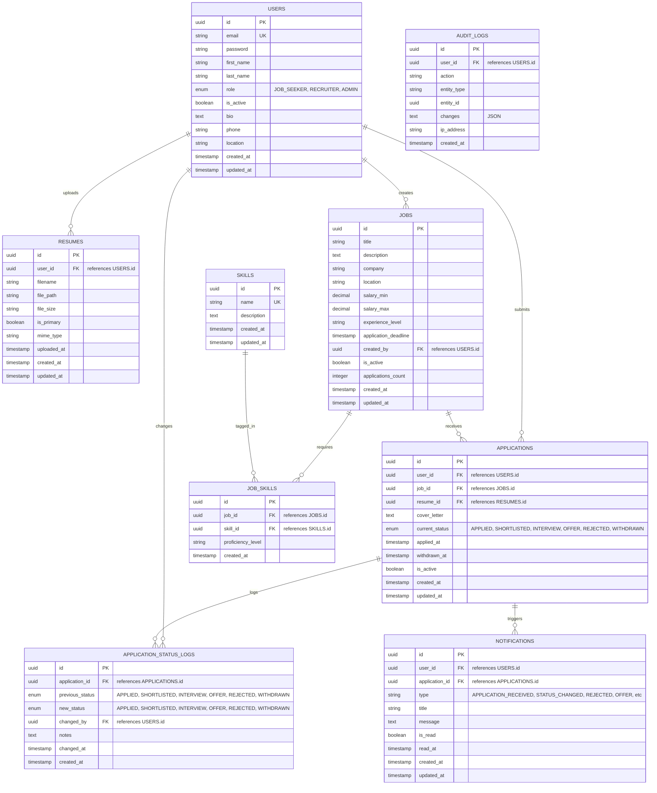

# ER Diagram - Database Schema

## Database Tables Description

### USERS Table
Primary table for storing user information. Supports three roles: Job Seeker, Recruiter, and Admin.

| Column | Type | Constraints | Description |
|--------|------|-----------|-------------|
| id | UUID | PK | Unique identifier |
| email | String | UNIQUE | User email for login |
| password | String | NOT NULL | Hashed password |
| first_name | String | NOT NULL | User's first name |
| last_name | String | NOT NULL | User's last name |
| role | ENUM | NOT NULL, DEFAULT: JOB_SEEKER | User role in system |
| is_active | Boolean | DEFAULT: true | Account status |
| bio | Text | | User biography |
| phone | String | | Contact number |
| location | String | | User location |
| created_at | Timestamp | NOT NULL | Account creation time |
| updated_at | Timestamp | NOT NULL | Last update time |

**Indexes**: email (UNIQUE), role, created_at

---

### JOBS Table
Stores job listings posted by recruiters/admins.

| Column | Type | Constraints | Description |
|--------|------|-----------|-------------|
| id | UUID | PK | Job listing ID |
| title | String | NOT NULL | Job title |
| description | Text | NOT NULL | Full job description |
| company | String | NOT NULL | Company name |
| location | String | NOT NULL | Job location |
| salary_min | Decimal | | Minimum salary |
| salary_max | Decimal | | Maximum salary |
| experience_level | String | | Required experience level |
| application_deadline | Timestamp | NOT NULL | Application deadline |
| created_by | UUID | FK → USERS.id | Recruiter who posted |
| is_active | Boolean | DEFAULT: true | Job is still open |
| applications_count | Integer | DEFAULT: 0 | Total applications |
| created_at | Timestamp | NOT NULL | Posting date |
| updated_at | Timestamp | NOT NULL | Last update |

**Indexes**: created_by, application_deadline, is_active, created_at

---

### APPLICATIONS Table
Core table tracking job applications.

| Column | Type | Constraints | Description |
|--------|------|-----------|-------------|
| id | UUID | PK | Application ID |
| user_id | UUID | FK → USERS.id | Job seeker |
| job_id | UUID | FK → JOBS.id | Applied job |
| resume_id | UUID | FK → RESUMES.id | Resume used |
| cover_letter | Text | | Application cover letter |
| current_status | ENUM | DEFAULT: APPLIED | Current pipeline status |
| applied_at | Timestamp | NOT NULL | Application submit time |
| withdrawn_at | Timestamp | | Withdrawal time if withdrawn |
| is_active | Boolean | DEFAULT: true | Application is active |
| created_at | Timestamp | NOT NULL | Record creation |
| updated_at | Timestamp | NOT NULL | Last update |

**Unique Constraint**: (user_id, job_id) - one application per user per job
**Indexes**: user_id, job_id, current_status, applied_at

---

### APPLICATION_STATUS_LOGS Table
Audit trail for application status changes. Provides full transparency.

| Column | Type | Constraints | Description |
|--------|------|-----------|-------------|
| id | UUID | PK | Log entry ID |
| application_id | UUID | FK → APPLICATIONS.id | Related application |
| previous_status | ENUM | | Status before change |
| new_status | ENUM | | Status after change |
| changed_by | UUID | FK → USERS.id | Recruiter who changed |
| notes | Text | | Reason for change |
| changed_at | Timestamp | NOT NULL | Change timestamp |
| created_at | Timestamp | NOT NULL | Log creation time |

**Indexes**: application_id, changed_at, changed_by

---

### RESUMES Table
Stores resume documents uploaded by job seekers.

| Column | Type | Constraints | Description |
|--------|------|-----------|-------------|
| id | UUID | PK | Resume ID |
| user_id | UUID | FK → USERS.id | Owner of resume |
| filename | String | NOT NULL | Original filename |
| file_path | String | NOT NULL | Server storage path |
| file_size | String | | File size in bytes |
| is_primary | Boolean | DEFAULT: false | Primary resume flag |
| mime_type | String | | File type (PDF, DOCX) |
| uploaded_at | Timestamp | NOT NULL | Upload timestamp |
| created_at | Timestamp | NOT NULL | Record creation |
| updated_at | Timestamp | NOT NULL | Last update |

**Indexes**: user_id, is_primary

---

### SKILLS Table
Reusable skill definitions used across multiple jobs.

| Column | Type | Constraints | Description |
|--------|------|-----------|-------------|
| id | UUID | PK | Skill ID |
| name | String | UNIQUE, NOT NULL | Skill name |
| description | Text | | Skill description |
| created_at | Timestamp | NOT NULL | Creation time |
| updated_at | Timestamp | NOT NULL | Last update |

**Indexes**: name (for quick lookup)

---

### JOB_SKILLS Table
Junction table linking jobs to required skills (many-to-many).

| Column | Type | Constraints | Description |
|--------|------|-----------|-------------|
| id | UUID | PK | Record ID |
| job_id | UUID | FK → JOBS.id | Job reference |
| skill_id | UUID | FK → SKILLS.id | Skill reference |
| proficiency_level | String | | Required level (Beginner, Intermediate, Expert) |
| created_at | Timestamp | NOT NULL | Record creation |

**Unique Constraint**: (job_id, skill_id) - avoid duplicate skills per job
**Indexes**: job_id, skill_id

---

### NOTIFICATIONS Table
Tracks all notifications sent to users.

| Column | Type | Constraints | Description |
|--------|------|-----------|-------------|
| id | UUID | PK | Notification ID |
| user_id | UUID | FK → USERS.id | Recipient |
| application_id | UUID | FK → APPLICATIONS.id | Related application |
| type | String | NOT NULL | Notification type |
| title | String | NOT NULL | Notification title |
| message | Text | NOT NULL | Notification message |
| is_read | Boolean | DEFAULT: false | Read status |
| read_at | Timestamp | | When marked as read |
| created_at | Timestamp | NOT NULL | Creation time |
| updated_at | Timestamp | NOT NULL | Last update |

**Types**: APPLICATION_RECEIVED, STATUS_CHANGED, REJECTED, OFFER, WITHDRAWN
**Indexes**: user_id, is_read, created_at

---

### AUDIT_LOGS Table
System-wide audit trail for compliance and debugging.

| Column | Type | Constraints | Description |
|--------|------|-----------|-------------|
| id | UUID | PK | Log ID |
| user_id | UUID | FK → USERS.id | User who made change |
| action | String | NOT NULL | Action performed |
| entity_type | String | NOT NULL | Entity type (USER, JOB, APPLICATION) |
| entity_id | UUID | NOT NULL | Entity ID |
| changes | JSON | | Changed fields and values |
| ip_address | String | | User IP address |
| created_at | Timestamp | NOT NULL | Log time |

**Indexes**: user_id, entity_type, entity_id, created_at

---

## Key Relationships

### One-to-Many
- **Users → Applications**: One user can submit many applications
- **Users → Resumes**: One user can upload multiple resumes
- **Users → Jobs**: One recruiter can post multiple jobs
- **Jobs → Applications**: One job receives many applications
- **Applications → Status Logs**: One application has many status changes

### Many-to-Many
- **Jobs ↔ Skills**: Jobs require multiple skills, skills are required by multiple jobs
  - Implemented through **JOB_SKILLS** junction table

### One-to-One (via Foreign Key)
- **Applications → Resumes**: Application submitted with one resume

---

## Data Integrity

### Foreign Keys
- All FK constraints enforce referential integrity
- ON DELETE CASCADE not recommended for safety
- Use soft deletes where appropriate (is_active flag)

### Unique Constraints
- Email must be unique per user
- One application per user per job
- Skill names are unique
- Job-Skill pair is unique (no duplicate requirements)

### Check Constraints
- Application deadline must be in future
- Salary_min ≤ Salary_max
- Status transitions follow allowed pipeline

---

## Indexes for Performance

### High-Priority Indexes
- `users(email)` - Login queries
- `applications(user_id, created_at)` - User's applications
- `applications(job_id, current_status)` - Job applicants by status
- `jobs(created_by, is_active)` - Recruiter's active jobs
- `application_status_logs(application_id, changed_at)` - History queries

### Medium-Priority Indexes
- `jobs(application_deadline)` - Deadline tracking
- `notifications(user_id, is_read)` - User's unread notifications
- `resumes(user_id, is_primary)` - Primary resume lookup
- `audit_logs(user_id, created_at)` - Audit trail

---

## Normalization

- **1NF**: All tables have atomic values
- **2NF**: All non-key attributes depend on full primary key
- **3NF**: No transitive dependencies
- **BCNF**: All determinants are candidate keys

No denormalization used initially; added only after performance profiling.
