# Class Diagram - Major Classes & Relationships

```mermaid
classDiagram
    %% Base/Abstract Classes
    class BaseModel {
        <<abstract>>
        -id: UUID
        -createdAt: Date
        -updatedAt: Date
        +getId(): UUID
        +getCreatedAt(): Date
    }

    %% Core Domain Models
    class User {
        -id: UUID
        -email: String
        -password: String (hashed)
        -firstName: String
        -lastName: String
        -role: UserRole
        -isActive: Boolean
        +register(): Boolean
        +login(): Boolean
        +updateProfile(): void
        +getApplications(): Application[]
    }

    class UserRole {
        <<enumeration>>
        JOB_SEEKER
        RECRUITER
        ADMIN
    }

    class Job {
        -id: UUID
        -title: String
        -description: String
        -company: String
        -location: String
        -salary_min: Decimal
        -salary_max: Decimal
        -experience_level: String
        -deadline: Date
        -createdBy: UUID (Recruiter)
        +create(): void
        +update(): void
        +delete(): void
        +getApplicationCount(): Integer
        +isOpen(): Boolean
    }

    class Skill {
        -id: UUID
        -name: String
        -description: String
        +getValue(): String
    }

    class Application {
        -id: UUID
        -jobId: UUID
        -userId: UUID
        -resumePath: String
        -coverletter: String
        -status: ApplicationStatus
        -appliedAt: Date
        -withdrawnAt: Date
        +submit(): Boolean
        +updateStatus(): void
        +withdraw(): void
        +getStatusHistory(): ApplicationStatusLog[]
        +isActive(): Boolean
    }

    class ApplicationStatus {
        <<enumeration>>
        APPLIED
        SHORTLISTED
        INTERVIEW
        OFFER
        REJECTED
        WITHDRAWN
    }

    class ApplicationStatusLog {
        -id: UUID
        -applicationId: UUID
        -previousStatus: ApplicationStatus
        -newStatus: ApplicationStatus
        -changedBy: UUID (Recruiter)
        -notes: String
        -changedAt: Date
        +getChangeDetails(): String
    }

    class Resume {
        -id: UUID
        -userId: UUID
        -filename: String
        -filepath: String
        -uploadedAt: Date
        -isPrimary: Boolean
        +upload(): void
        +delete(): void
        +getPath(): String
    }

    %% Service Layer Classes
    class AuthService {
        -userRepository: UserRepository
        -jwtConfig: JWTConfig
        +register(email, password): AuthToken
        +login(email, password): AuthToken
        +validateToken(token): User
        +refreshToken(token): AuthToken
        +logout(token): void
    }

    class JobService {
        -jobRepository: JobRepository
        -skillRepository: SkillRepository
        +createJob(jobData): Job
        +updateJob(jobId, data): Job
        +deleteJob(jobId): void
        +searchJobs(filters): Job[]
        +getJobDetails(jobId): Job
        +addSkills(jobId, skills): void
    }

    class ApplicationService {
        -applicationRepository: ApplicationRepository
        -jobRepository: JobRepository
        -emailService: EmailService
        -notificationService: NotificationService
        +submitApplication(userId, jobId, resume): Application
        +updateApplicationStatus(appId, newStatus): void
        +withdrawApplication(appId): void
        +getApplications(userId): Application[]
        +getApplicationsForJob(jobId): Application[]
    }

    class EmailService {
        -emailConfig: EmailConfig
        -emailQueue: Queue
        +sendApplicationConfirmation(user, job): void
        +sendStatusUpdate(user, application, newStatus): void
        +sendRejectionEmail(user, application): void
        +sendOfferEmail(user, application): void
        -queueEmail(email): void
        -processQueue(): void
    }

    class NotificationService {
        -emailService: EmailService
        -notificationRepository: NotificationRepository
        +notify(userId, type, data): void
        +markAsRead(notificationId): void
        +getNotifications(userId): Notification[]
    }

    %% Repository Pattern
    class UserRepository {
        <<interface>>
        +findById(id): User
        +findByEmail(email): User
        +create(user): User
        +update(user): User
        +delete(id): void
    }

    class JobRepository {
        <<interface>>
        +findById(id): Job
        +findAll(): Job[]
        +findWithFilters(filters): Job[]
        +create(job): Job
        +update(job): Job
        +delete(id): void
    }

    class ApplicationRepository {
        <<interface>>
        +findById(id): Application
        +findByUserId(userId): Application[]
        +findByJobId(jobId): Application[]
        +create(application): Application
        +update(application): Application
        +delete(id): void
    }

    %% Controller Layer
    class AuthController {
        -authService: AuthService
        +register(req, res): void
        +login(req, res): void
        +refreshToken(req, res): void
        +logout(req, res): void
    }

    class JobController {
        -jobService: JobService
        +getAllJobs(req, res): void
        +getJobById(req, res): void
        +createJob(req, res): void
        +updateJob(req, res): void
        +deleteJob(req, res): void
        +searchJobs(req, res): void
    }

    class ApplicationController {
        -applicationService: ApplicationService
        +submitApplication(req, res): void
        +getApplications(req, res): void
        +getApplicationById(req, res): void
        +updateApplicationStatus(req, res): void
        +withdrawApplication(req, res): void
    }

    %% Middleware & Utils
    class AuthMiddleware {
        +verifyToken(req, res, next): void
        +authorize(roles): Function
        +checkPermission(resource, action): Function
    }

    class ValidationMiddleware {
        +validateRequest(schema): Function
        +validateFileUpload(options): Function
    }

    class ErrorHandler {
        +handleError(error): ErrorResponse
        +logError(error): void
    }

    class JWTConfig {
        -secretKey: String
        -expiresIn: String
        +sign(payload): String
        +verify(token): Object
        +decode(token): Object
    }

    %% Relationships
    BaseModel <|-- User
    BaseModel <|-- Job
    BaseModel <|-- Application
    BaseModel <|-- Resume

    User "1" -- "*" Application : has
    User "1" -- "*" Resume : uploads
    Job "1" -- "*" Application : receives
    Job "*" -- "*" Skill : requires
    Application "1" -- "*" ApplicationStatusLog : logs

    User --> UserRole : has
    Application --> ApplicationStatus : has
    ApplicationStatusLog --> ApplicationStatus : tracks

    %% Service Dependencies
    AuthService --> UserRepository
    JobService --> JobRepository
    JobService --> SkillRepository
    ApplicationService --> ApplicationRepository
    ApplicationService --> JobRepository
    ApplicationService --> EmailService
    ApplicationService --> NotificationService

    EmailService --> NotificationService
    NotificationService --> NotificationRepository

    %% Controller Dependencies
    AuthController --> AuthService
    JobController --> JobService
    ApplicationController --> ApplicationService

    %% Middleware
    AuthController --> AuthMiddleware
    JobController --> AuthMiddleware
    ApplicationController --> AuthMiddleware

    ValidationMiddleware --> ErrorHandler
    AuthMiddleware --> JWTConfig

    %% Repository Implementations (Sequelize)
    UserRepository <|.. UserRepositoryImpl
    JobRepository <|.. JobRepositoryImpl
    ApplicationRepository <|.. ApplicationRepositoryImpl
```

## Class Details

### Domain Models

**User**
- Core user entity with authentication details
- Has role-based access control (Job Seeker, Recruiter, Admin)
- One-to-many relationship with Applications and Resumes

**Job**
- Job listing posted by recruiters
- Contains job details, location, salary, deadline
- Tracks skills required
- Validates application deadline

**Application**
- Represents job application by user for a specific job
- Tracks application status through pipeline
- Stores resume reference
- Maintains application history

**ApplicationStatusLog**
- Audit trail for every status change
- Records who changed status and when
- Allows transparency and history tracking

**Resume**
- User's uploaded resume document
- Can have multiple resumes per user
- One marked as primary

**Skill**
- Job skills/requirements
- Reusable across multiple jobs

### Service Layer

**AuthService**
- Handles user registration, login, token management
- Implements JWT token lifecycle
- Validates credentials securely

**JobService**
- CRUD operations for jobs
- Search and filtering logic
- Skill management for jobs

**ApplicationService**
- Application submission workflow
- Status update orchestration
- Triggers email and notification services
- Withdraw application functionality

**EmailService**
- Sends various email notifications
- Implements email queue for async processing
- Different email templates for different events

**NotificationService**
- Manages user notifications
- Integrates with email service
- Tracks notification read status

### Repository Pattern

- Abstracts database operations
- Allows easy switching between databases
- Enables unit testing with mocks
- Follows dependency injection

### Controllers

- Handle HTTP requests/responses
- Delegate business logic to services
- Validate input
- Format responses

### Middleware & Utilities

- **AuthMiddleware**: JWT verification, role-based access
- **ValidationMiddleware**: Request data validation
- **ErrorHandler**: Centralized error handling
- **JWTConfig**: Token generation and verification

## Design Patterns Used

1. **Repository Pattern**: Data access abstraction
2. **Service Layer**: Business logic separation
3. **Dependency Injection**: Loose coupling
4. **Singleton**: AuthService, EmailService instances
5. **Factory**: User and Job creation
6. **Observer**: Email notifications on status changes
7. **Strategy**: Different authentication strategies
