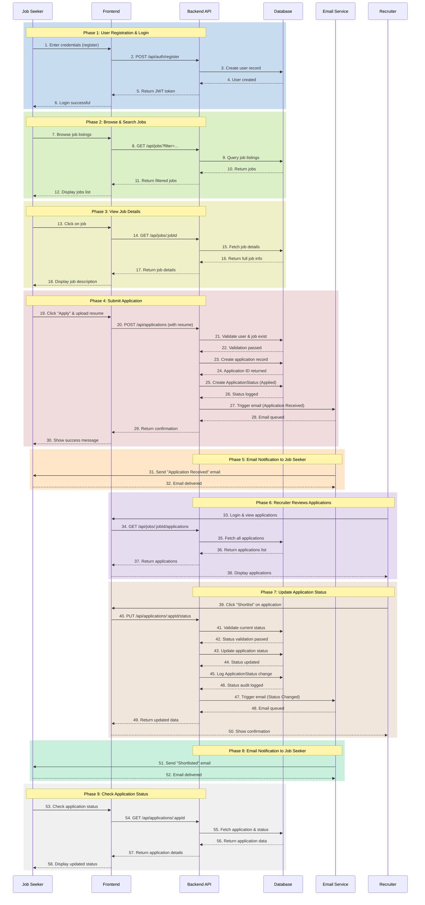

# Sequence Diagram - Main Flow: Job Application with Status Update

## End-to-End Flow Summary

### Main Workflow Phases

1. **Authentication (Steps 1-6)**
   - Job seeker registers/logs in
   - Backend validates credentials and returns JWT token
   - Frontend stores token for authenticated requests

2. **Browse & Search (Steps 7-12)**
   - User browses available job listings
   - Can filter by title, location, experience level, etc.
   - Backend returns filtered results from database

3. **View Details (Steps 13-18)**
   - User clicks on specific job
   - Backend fetches full job details
   - User sees complete job description and requirements

4. **Apply for Job (Steps 19-30)**
   - User clicks apply and uploads resume
   - Frontend sends application with resume file
   - Backend validates user and job exist
   - Backend creates application record
   - Backend logs initial status as "Applied"
   - Email service is triggered

5. **Email Confirmation (Steps 31-32)**
   - Email system sends confirmation to job seeker
   - Job seeker receives application receipt email

6. **Recruiter Reviews (Steps 33-38)**
   - Recruiter logs in and views applications for their jobs
   - Backend fetches all applications for that job
   - Recruiter sees list of candidates

7. **Update Status (Steps 39-50)**
   - Recruiter changes application status (e.g., to "Shortlisted")
   - Backend validates status transition is allowed
   - Backend updates application record
   - Backend logs status change in audit trail
   - Email service is triggered with new status

8. **Status Notification (Steps 51-52)**
   - Email system sends status update to job seeker
   - Job seeker is notified of progress

9. **Check Status (Steps 53-58)**
   - Job seeker can check application status anytime
   - Backend returns current application state with history

## Key Design Decisions

- **Async Email**: Emails are queued asynchronously to avoid blocking the API
- **Status Audit Trail**: Every status change is logged for transparency
- **Validation**: Status transitions are validated (can't go backward)
- **JWT Auth**: Token-based authentication for API security
- **Separation of Concerns**: Email logic separated into service
- **Database Transactions**: Application creation is atomic
