# Use Case Diagram

```mermaid
graph TB
    subgraph System["Job Application Tracker System"]
        UC1["Register/Login"]
        UC2["Browse Job Listings"]
        UC3["Search & Filter Jobs"]
        UC4["Apply for Job"]
        UC5["Upload Resume"]
        UC6["View Application Status"]
        UC7["Withdraw Application"]
        UC8["View Application History"]
        UC9["Receive Email Notification"]
        UC10["Update Application Status"]
        UC11["View Job Details"]
        UC12["Create Job Listing"]
        UC13["Edit Job Listing"]
        UC14["Delete Job Listing"]
        UC15["View Applications"]
        UC16["View Analytics"]
        UC17["Manage Users"]
        UC18["View System Reports"]
    end

    JobSeeker["👤 Job Seeker"]
    Recruiter["👥 Recruiter"]
    Admin["⚙️ Admin"]
    EmailSystem["📧 Email System"]

    %% Job Seeker Use Cases
    JobSeeker -->|performs| UC1
    JobSeeker -->|performs| UC2
    JobSeeker -->|performs| UC3
    JobSeeker -->|performs| UC4
    JobSeeker -->|performs| UC5
    JobSeeker -->|performs| UC6
    JobSeeker -->|performs| UC7
    JobSeeker -->|performs| UC8
    JobSeeker -->|performs| UC11

    %% Recruiter Use Cases
    Recruiter -->|performs| UC1
    Recruiter -->|performs| UC2
    Recruiter -->|performs| UC10
    Recruiter -->|performs| UC12
    Recruiter -->|performs| UC13
    Recruiter -->|performs| UC14
    Recruiter -->|performs| UC15
    Recruiter -->|performs| UC16

    %% Admin Use Cases
    Admin -->|performs| UC1
    Admin -->|performs| UC12
    Admin -->|performs| UC13
    Admin -->|performs| UC14
    Admin -->|performs| UC15
    Admin -->|performs| UC17
    Admin -->|performs| UC18

    %% Email System
    UC4 -.->|triggers| UC9
    UC10 -.->|triggers| UC9
    UC7 -.->|triggers| UC9

    %% Include/Extend relationships
    UC4 -->|includes| UC5
    UC4 -->|includes| UC11
    UC6 -->|extends| UC8
    UC2 -->|includes| UC3
    UC15 -->|includes| UC10
```

## Use Case Descriptions

### Primary Actors
1. **Job Seeker**: Individual looking for job opportunities
2. **Recruiter**: Hiring manager posting jobs and reviewing applications
3. **Admin**: System administrator managing users and system configuration
4. **Email System**: External system sending notifications

### Use Cases

| Use Case ID | Name | Actor | Description |
|---|---|---|---|
| UC1 | Register/Login | All | User creates account or logs in with credentials |
| UC2 | Browse Job Listings | Job Seeker, Recruiter | View all available job listings |
| UC3 | Search & Filter Jobs | Job Seeker | Filter jobs by title, location, experience level |
| UC4 | Apply for Job | Job Seeker | Submit application for a job posting |
| UC5 | Upload Resume | Job Seeker | Upload or attach resume document |
| UC6 | View Application Status | Job Seeker | Check current status of submitted applications |
| UC7 | Withdraw Application | Job Seeker | Cancel/withdraw a pending application |
| UC8 | View Application History | Job Seeker | View all past applications |
| UC9 | Receive Email Notification | All (Email) | System sends email on status changes |
| UC10 | Update Application Status | Recruiter | Change application status in pipeline |
| UC11 | View Job Details | Job Seeker, Recruiter | See full job description and requirements |
| UC12 | Create Job Listing | Recruiter, Admin | Post a new job listing |
| UC13 | Edit Job Listing | Recruiter, Admin | Modify existing job details |
| UC14 | Delete Job Listing | Recruiter, Admin | Remove a job listing |
| UC15 | View Applications | Recruiter | See all applications for posted jobs |
| UC16 | View Analytics | Recruiter | View application statistics and metrics |
| UC17 | Manage Users | Admin | Create, suspend, or delete user accounts |
| UC18 | View System Reports | Admin | Access system-wide analytics and logs |

### Key Relationships
- **Includes**: UC4 includes UC5 and UC11 (applying requires uploading resume and viewing job details)
- **Extends**: UC6 extends UC8 (status tracking extends application history)
- **Triggers**: UC4, UC10, UC7 trigger UC9 (email notifications)